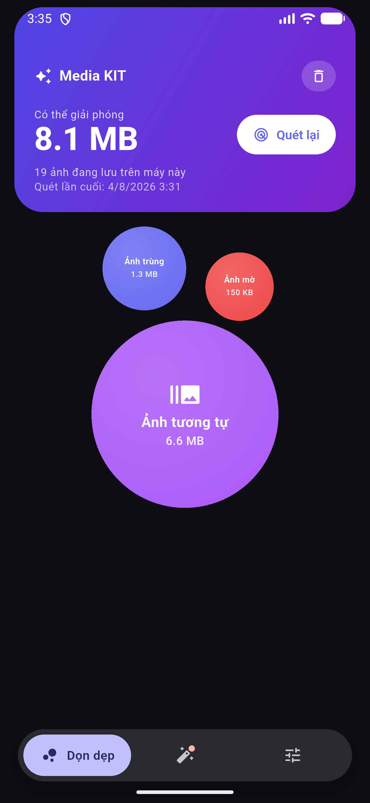
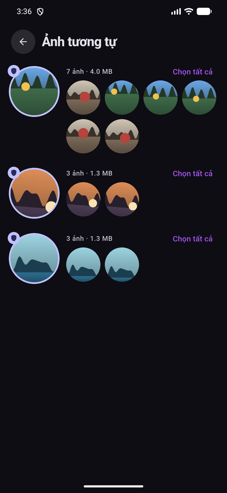
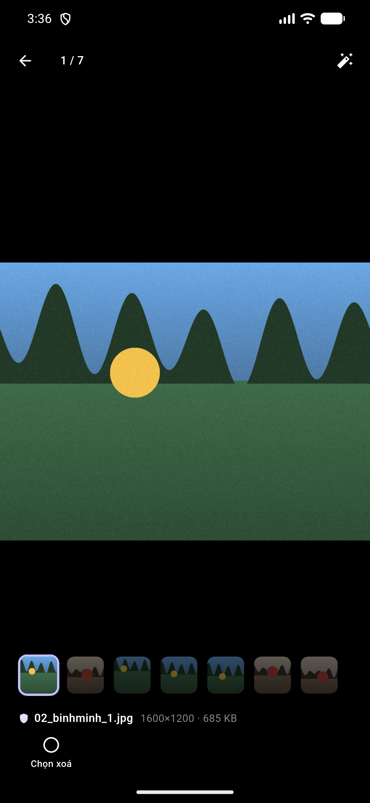
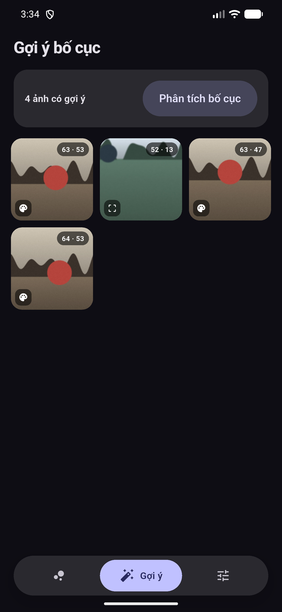
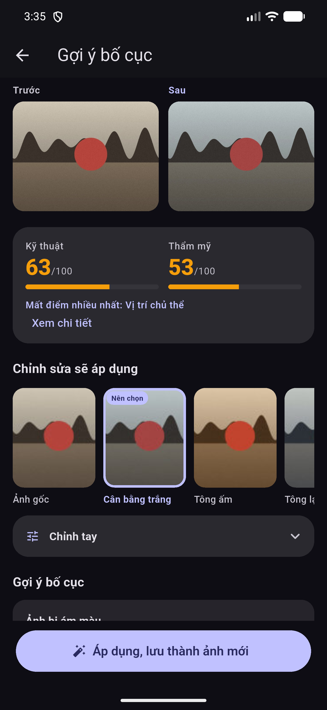
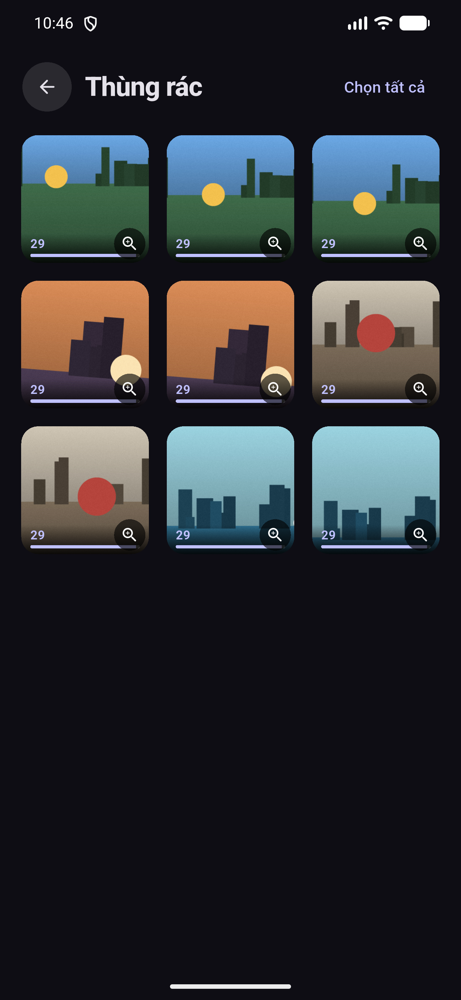

# Media KIT

**Dọn gọn thư viện ảnh, và chỉ cho bạn ảnh nào có thể đẹp hơn.**
Toàn bộ phân tích chạy trên máy bạn — không ảnh nào rời khỏi thiết bị.

**[Trang giới thiệu và tải về →](https://mittohoa.github.io/media-kit/)**

---

| Dọn dẹp | Ảnh tương tự | Xem từng tấm |
|---|---|---|
|  |  |  |

| Chấm điểm | Gợi ý bố cục | Thùng rác |
|---|---|---|
|  |  |  |

Kích thước hình tròn tỉ lệ với dung lượng — nhìn là biết dung lượng đang nằm ở
nhóm nào. Ở thùng rác, vạch dưới mỗi ảnh vơi dần theo thời hạn 30 ngày.

> **Ảnh trong máy là ảnh minh hoạ tự sinh, không phải ảnh của ai cả.** Ảnh chụp
> màn hình đưa lên nơi công khai không được chứa ảnh thật của bất kỳ ai, kể cả
> của tác giả — nên thư viện dùng để chụp được dựng bằng
> [`tool/generate_demo_photos.dart`](https://github.com/mittohoa/media-kit),
> cố ý có sẵn ảnh trùng, ảnh gần giống nhau, ảnh mờ và chân trời nghiêng để mọi
> tính năng đều có cái mà bắt.

## Media KIT giải quyết chuyện gì

Điện thoại đầy bộ nhớ, mà nhìn vào thư viện thì không biết xoá gì. Mười tấm giống
hệt nhau, ảnh mờ, ảnh chụp màn hình từ năm ngoái — chúng lẫn vào nhau và không ai
đủ kiên nhẫn lọc tay.

Ngược lại, có những tấm đáng giữ nhưng hơi nghiêng, hơi lệch bố cục, hơi ám màu.
Biết là chưa đẹp nhưng không biết sai ở đâu, càng không biết sửa thế nào.

Media KIT làm đúng hai việc đó:

| | |
|---|---|
| 🧹 **Dọn dẹp** | Gom ảnh trùng, ảnh tương tự, ảnh mờ, ảnh chụp màn hình, bản chia sẻ chất lượng thấp — kèm dung lượng giải phóng được của từng nhóm |
| ✨ **Nâng chất lượng** | Chấm điểm từng ảnh (kỹ thuật và thẩm mỹ tách riêng), chỉ ra sai ở đâu, và **dựng sẵn vài phương án chỉnh sửa** để bạn chọn |

## Ba nguyên tắc không thoả hiệp

1. **Không bao giờ tự xoá.** App chỉ đề xuất; bạn tự tick, tự bấm. Ảnh đã xoá nằm
   trong thùng rác 30 ngày.
2. **Không bao giờ ghi đè ảnh gốc.** Mỗi lần chỉnh sửa ghi ra một file mới trong
   album riêng, đóng dấu để tra ngược về ảnh gốc.
3. **Không gửi ảnh đi đâu.** App chạm mạng đúng một việc: đọc một file JSON nhỏ
   ghi phiên bản mới nhất — nhiều nhất mỗi ngày một lần — và tải bản cập nhật
   khi bạn đồng ý. Không có gì về thư viện ảnh đi kèm request đó.

## Tính năng

**Dọn dẹp**

- Trùng tuyệt đối (MD5) và trùng nội dung (perceptual hash + BK-tree)
- Ảnh mờ, ngưỡng tính theo chính thư viện của bạn chứ không phải con số cố định
- Ảnh chụp màn hình, nhận qua so kích thước màn hình — chắc hơn đoán theo tên file
- Bản chia sẻ chất lượng thấp, nhận qua dấu vết metadata bị lược
- Ảnh đã sao lưu cloud (Google Drive, OneDrive) — đối chiếu bằng checksum, không tải ảnh về
- Tách bạch "ảnh trùng" và "ảnh tương tự"; nhóm tương tự không bao giờ tự tick chọn xoá
- Mỗi mục một kiểu bày riêng, chọn theo cấu trúc dữ liệu của mục đó

**Chấm điểm và chỉnh sửa**

- Hai điểm tách riêng: **kỹ thuật** (độ nét, phơi sáng, tương phản, màu, độ phân
  giải) và **thẩm mỹ** (vị trí chủ thể, đường chân trời, chủ thể trọn vẹn, kích
  thước, cân bằng). Mỗi mục truy ngược được về một phép đo cụ thể
- Quy tắc bố cục: nghiêng chân trời, chủ thể bị cắt, lệch điểm mạnh, chủ thể quá
  nhỏ, mất cân bằng, phơi sáng, ám màu
- Quy tắc chân dung: khoảng trống trên đầu, khoảng trống hướng nhìn, mặt bị cắt ở
  mép — dùng ML Kit nhận diện khuôn mặt
- Phân vùng chủ thể cho ảnh không có người
- Bản xem trước dựng sẵn cho từng phương án, thêm thanh trượt chỉnh tay
- Giữ nguyên EXIF khi lưu: ngày chụp, toạ độ, thông số máy

**Khác**

- Dark mode, chọn phông và cỡ chữ
- Tiếng Việt và English
- Chỉ mục SQLite: lần quét sau chỉ xử lý ảnh mới

## Nền tảng

| Nền tảng | Trạng thái | Ghi chú |
|---|---|---|
| Android 7.0+ | Đầy đủ | Cần API 24 trở lên do ML Kit |
| Windows | Đầy đủ trừ phần khuôn mặt và phân vùng chủ thể | Đọc ảnh từ một thư mục, thường là bản xuất Google Takeout |
| iOS 15.5+ | **Chưa dựng thử lần nào** | Cấu hình đã rà nhưng cần macOS + Xcode mới dựng được. Không có phân vùng chủ thể — ML Kit chưa hỗ trợ iOS |

## Số liệu đo trên máy thật

Pixel 6 Pro, thư viện 259 ảnh:

| | |
|---|---|
| Quét thư viện lần đầu | 13 giây (51 ms mỗi ảnh) |
| Quét lại (đã có chỉ mục) | dưới 1 giây |
| Phân tích bố cục cả thư viện | khoảng 90 giây |
| Tỉ lệ ảnh nhận được gợi ý | 37% |

Windows, thư viện dựng sẵn 4.000 ảnh (7 GB):

| | |
|---|---|
| Quét lại khi mọi ảnh đã có chỉ mục | 1,0 giây (0,25 ms mỗi ảnh) |

## Cài đặt

1. Vào [trang phát hành](https://github.com/mittohoa/media-kit/releases) và tải
   file APK hợp với máy: **arm64-v8a** cho hầu hết điện thoại đời mới,
   **armeabi-v7a** cho máy cũ.
2. Mở file vừa tải, Android sẽ hỏi có cho phép cài từ nguồn này không — đồng ý.
3. Mở app và cấp quyền truy cập ảnh.

Cài xong thì không cần quay lại đây: app tự hỏi bản mới khi mở, và mời cập nhật
ngay trong app — tải nền, đối chiếu SHA-256, rồi mở trình cài đặt.

> Mã nguồn nằm ở kho riêng. Repo này chứa tài liệu và các bản phát hành.

## Xử lý thư viện Google Photos trên Windows

Đường duy nhất chạm được toàn bộ thư viện là **Google Takeout**:

1. Xuất thư viện bằng [Google Takeout](https://takeout.google.com), giải nén ra một thư mục.
2. **Giữ nguyên các file `.json`** nằm cạnh mỗi ảnh. Takeout không xoá metadata —
   nó chuyển ngày chụp và toạ độ sang các file đó.
3. Mở bản Windows, chọn thư mục vừa giải nén.
4. Quét và xử lý như bình thường. Khi lưu ảnh đã chỉnh, app ghi metadata ngược vào
   EXIF nên tải lên lại vẫn còn đủ thông tin.

## Góp ý

Gặp lỗi hay có ý tưởng: [mittohoa@gmail.com](mailto:mittohoa@gmail.com), hoặc mở
issue ngay tại repo này. Ảnh chụp màn hình càng tốt.

## Tài liệu

- [PROJECT.MD](PROJECT.MD) — đặc tả đầy đủ: mục tiêu, kiến trúc, từng quyết định
  và lý do đằng sau nó
- [photos.md](photos.md) — nghiên cứu về bố cục ảnh, nền tảng cho bộ quy tắc

## Giấy phép

[MIT](LICENSE).
